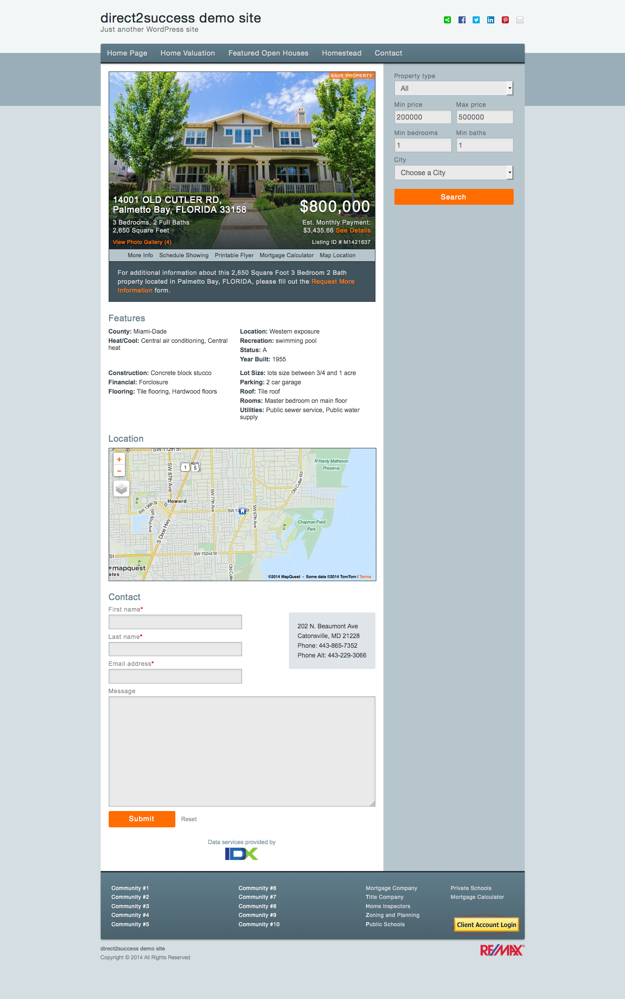

## Cursory browser tests

<a href="https://raw.githubusercontent.com/mhulse/sass-test/gh-pages/screen.png"></a>

### MAC (Yosemite):

* Firefox `33.1.1`
* Chrome `38.0.2125.122`
* Safari `8.0`
* Opera `26`

### PC:

* Opera `26.0`, Windows Vista
* Opera `12.1.4`, Windows Vista
* Opera `12.1.4`, Windows Vista
* Safari `5.1.7`, Windows Vista (needs fine-tuning)
* Chrome `39.0.2171.65 m`, Windows Vista
* Chrome `38.0.2125.111 m`, Windows Vista
* Firefox `33.1.1`, Windows Vista
* Firefox `12.0`, Windows Vista
* IE `8`, Windows 7 (needs more work)
* IE `9`, Windows 7 (needs fine-tuning)
* IE `10`, Windows 8
* IE `11`, Windows 8.1

## Development commands

```bash
$ cd sass-test/
# Install or update gems:
$ bundle install
# … or:
$ bundle update
# Have Sass watch while you develop:
$ bundle exec sass --watch styles/scss:styles/css --style expanded --scss --trace --sourcemap=none
```
